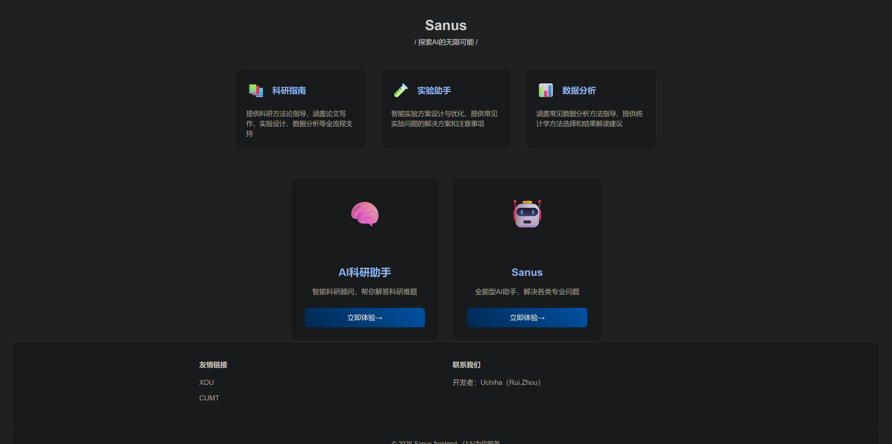
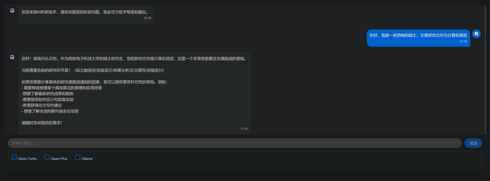
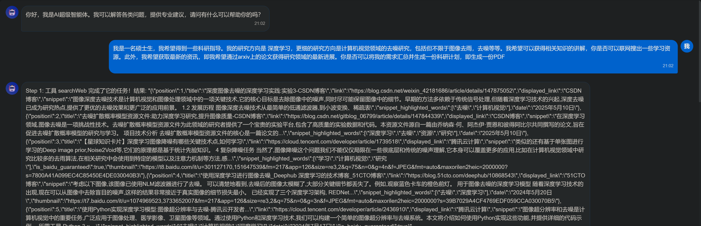
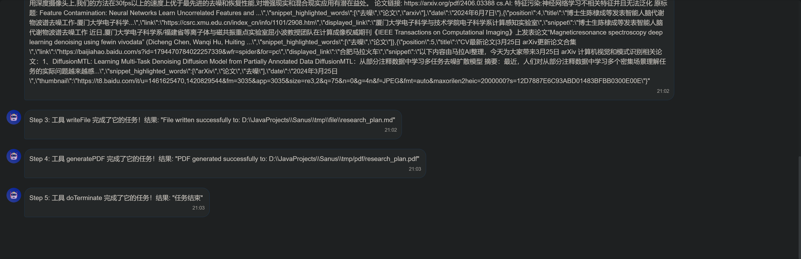

# Sanus

🚀 **Sanus** — 专为科研人打造的智能 AI 科研助手

---

## 📌 项目简介

**Sanus** 是一款基于 **Spring Boot 3 + Spring AI + RAG + MCP** 架构开发的科研助手，  
支持多轮对话、向量化知识检索、可调用工具链、Arxiv 论文搜索等功能，  
灵活接入本地及云端大模型，助力科研人高效完成文献调研、思路整理、论文写作等核心任务。

👉 [项目地址](https://github.com/zhouruii/Sanus)

---

## ✨ 核心特性

- **多模型支持**：基于 Spring AI 集成 Qwen、Ollama 等多种大模型，云端/本地部署可自由切换，兼顾灵活性与成本。
- **上下文记忆**：支持多轮对话上下文记忆，并提供 Kryo 序列化持久化方案，防止服务重启丢失上下文，提升用户体验与稳定性。
- **向量化知识检索 (RAG)**：结合 PostgreSQL + PGVector 实现高效向量检索，支持元信息过滤与查询优化，提升回答的相关性与精度。
- **MCP 工具链**：内置 Arxiv 论文检索 MCP 服务，集中式注册可调用工具，支持联网搜索、资源下载等，增强科研场景外部信息获取能力。
- **分层智能体架构**：借鉴 OpenManus，采用 ReAct + CoT 思路实现任务分解与多步骤推理，支持复杂科研任务自动化执行。
- **流式推理输出**：基于 SSE + CompletableFuture 实现推理任务异步化与实时可视化，推理步骤流式输出，增强交互体验和可观测性。

---

## ⚙️ 技术栈

- **后端框架**：Spring Boot 3、Spring AI
- **向量检索**：PostgreSQL + PGVector
- **对话记忆持久化**：Kryo 序列化
- **异步流式输出**：SseEmitter + CompletableFuture
- **工具链 (MCP)**：Arxiv 搜索、联网资源下载
- **智能体设计**：ReAct + CoT 分层推理架构

---

## 🚀 Demo

